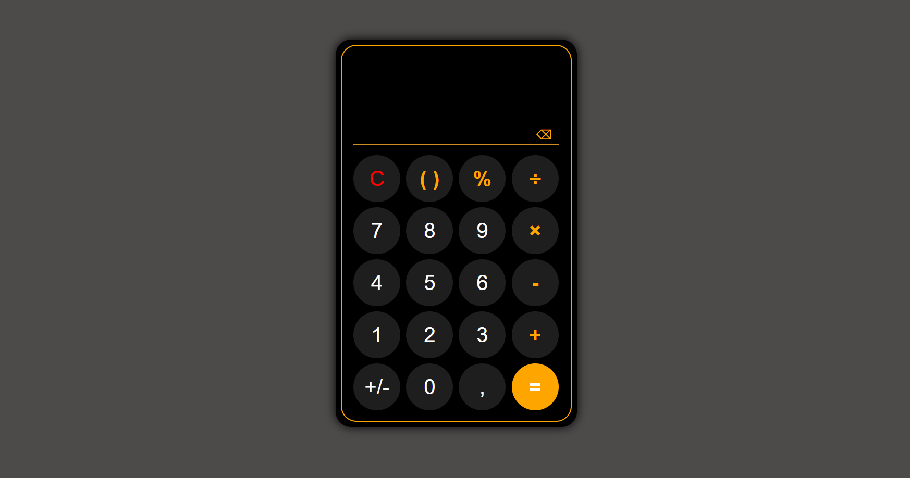

# Calculator

A responsive calculator built with HTML, CSS, and Vanilla JavaScript featuring a custom expression parser and evaluator.

## Table of contents

- [Overview](#overview)
  - [The Project](#the-project)
  - [Screenshot](#screenshot)
  - [Links](#links)
- [My process](#my-process)
  - [Built with](#built-with)
  - [What I learned](#what-i-learned)
  - [Future Improvements](#future-improvements)
- [Author](#author)

## Overview

### The Project

Build a fully functional calculator that supports:

- Keyboard and button input
- Percentage calculations
- Negative numbers
- Automatic parenthesis handling
- Real-time result previews
- A custom expression parser and evaluator
- Expression evaluation without using JavaScript's built-in `eval()` function

### Screenshot

### Links

## My process

### Built with

- Semantic HTML5 markup
- CSS custom properties
- Flexbox
- CSS Grid
- Vanilla JavaScript

### What I learned

This project helped me improve my understanding of:

- Building a custom expression parser and evaluator
- Tokenizing mathematical expressions using regular expressions
- Handling operator precedence and associativity
- Managing calculator state after evaluation
- Synchronizing keyboard and button input
- Identifying and fixing edge cases involving percentages, negative numbers, and division by zero

### Future Improvements

Potential future additions:

- Calculation history
- Theme switching

## Author

- GitHub – [theOroszlan](https://github.com/theoroszlan)
